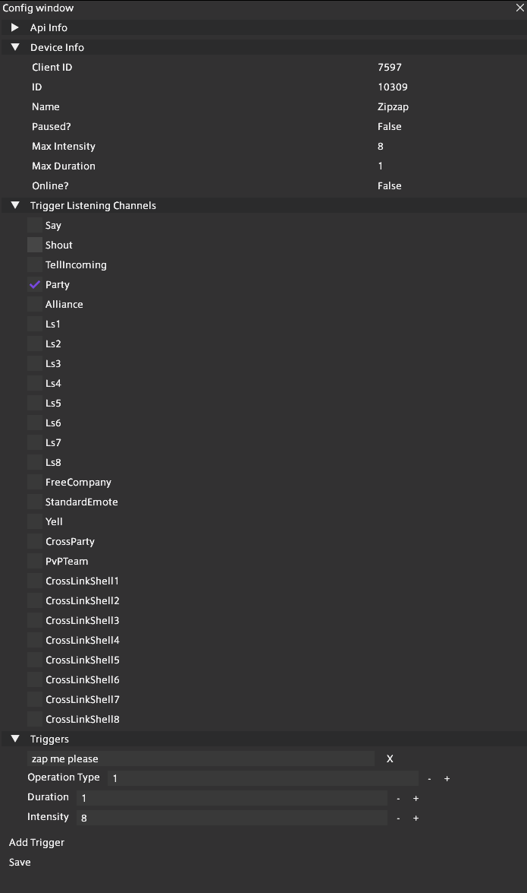

# Shocky

A pishock plugin for FFXIV.

## Main Points

* Can input pishock Apikey, Name, Code to connect to a device.
* Will show connected device information (whether it's online, paused, max intensity, duration, etc).
* Can setup listening on particular game channels (Linkshell 1, Party, etc)
* Can add multiple triggers: words, operation, intensity, and duration.

## How To Use

### Getting Started

1. Add `https://raw.githubusercontent.com/Noodlefu/Shocky/main/repo.json` to your experimental repo's.
2. Install plugin.
3. Go to settings and add your Apikey, Name, and Code.
4. Start setting up your triggers and listening channels, and shock away.

### Prerequisites

Owning a pishock compatible device.

### Building

1. Open up `Shocky.sln` in your C# editor of choice (likely [Visual Studio 2022](https://visualstudio.microsoft.com) or [JetBrains Rider](https://www.jetbrains.com/rider/)), or open directory with VS Code.
2. Build the solution. By default, this will build a `Debug` build, but you can switch to `Release` in your IDE.
3. The resulting plugin can be found at `Shocky/bin/x64/Debug/Shocky.dll` (or `Release` if appropriate.)

### Settings

### Operations

Operations are currently:
0 - Shock
1 - Vibrate
2 - Beep

See Pishock docs for more info https://apidocs.pishock.com